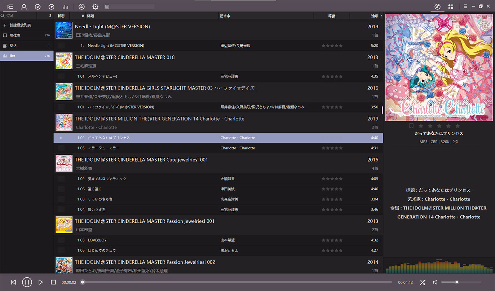
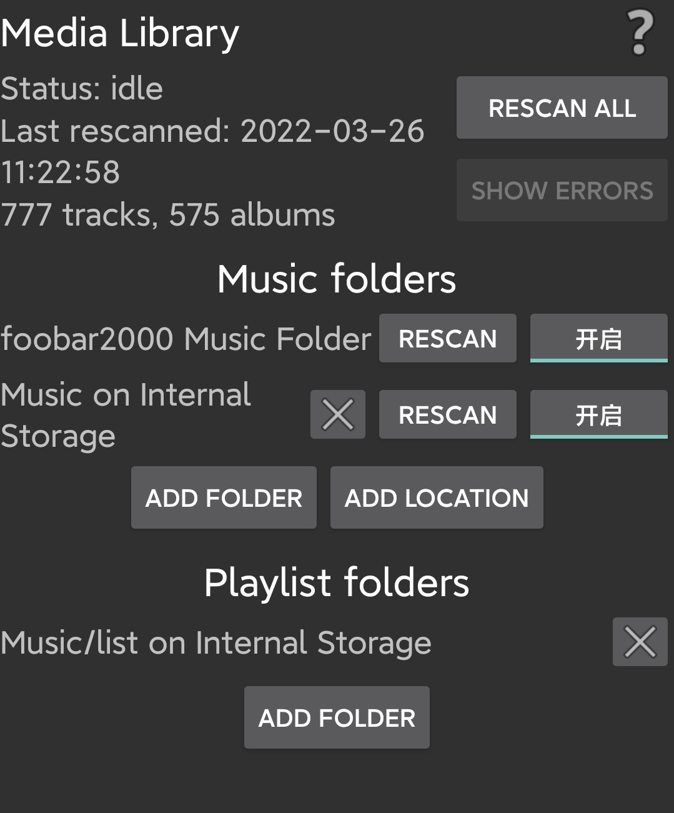
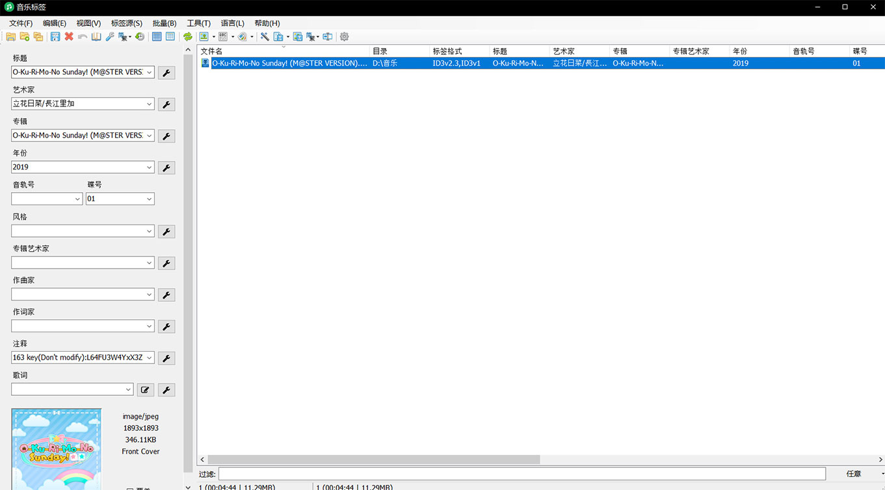

网抑云，我真的好喜欢你啊，为了你，我要用Foobar！

<!--more-->

## 关于网抑云吞我歌单导致我怀恨在心直到现在终于找到方案同步音乐歌单所以不再用网易云存歌单这件事

众所周知网抑云下架歌曲就算了，它甚至把用户歌单内的下架歌曲不是灰了而是直接消失不见。你可能无法想象作为一个纯强迫症某一天突然发现歌单少了一堆歌是什么感受

为了不再让自己活在担惊受怕之中，也防止某一天网易云突然暴毙，也该转移自己的歌曲和歌单到本地了

这是我很多年前做出的第一步，把所有歌曲下载到本地，当然这其中也有为了拷进mp3的原因，但这个习惯最后保留了下来，于是我就有了从六年前开始积累的776首本地歌曲（截止至2022年3月26日01:26:56），它们按照修改时间排序基本就是我的歌单的顺序

于是前提准备好了，也该到时候进一步和网络音乐播放器say goodbye~了

## 初识Foobox

在知乎搜寻好用的本地音频播放器时，我偶然发现了Foobar2000，和国人魔改的Foobox

Foobar2000是一款免费的音频播放器软件，不仅具有强大的功能，并且拥有自己的SDK供用户开发自己的插件，因此其具有相当大的插件数量和一个较好的社区氛围。而dream7180在此基础上集合主题、一些插件以及汉化之后就形成了Foobox



## 导入歌单

通过Foobox界面右上角三横点开“文件->参数选项”打开选项菜单，之后在菜单左侧选择媒体库，就可以在音乐文件夹内添加本地音乐所在的文件夹

导入音乐文件后在主界面左侧新建一个播放列表，并将媒体库导入的所有歌拖入新建歌单中

之后点击右上角三横“编辑->排序->排序按...”，之后在跳出的窗口中我们可以根据一定语法对歌曲进行排序，在这里因为我自己歌单和本地歌曲是修改时间顺序关系，因此语法便是`%last_modified%`

这样歌单就简单地完成了迁移，并且可以使用`ctrl+s`进行歌单的保存，我建议在音乐文件夹下建立子文件夹存储这个歌单fpl文件（当然也可以选择存储为m3u或m3u8文件）

将本地文件和歌单文件拷贝至手机后可以使用Foobar的手机端，在设置的Media Library选项下分别选择音乐和歌单的文件夹进行导入，简单的手动同步就完成了



## 云端同步

这里使用onedrive实现电脑和手机的音乐和歌单的同步

在windows下，因为onedrive只能在指定的文件夹下进行同步，为了能够让onedrive同步音乐，我们选择在onedrive文件夹下使用mklink命令创建快捷方式，使得onedrive可以检测到音乐文件夹并进行同步，具体**CMD**命令如下

```cmd
mklink /d Link Target
```

其中：  
`/d`意味着生成文件夹的连接；  
`Link`是在onedrive文件夹生成的文件夹名称，如`(somepath)\onedrive\music`，那么该命令就会在onedrive文件夹下生成一个music文件夹（注意使用该指令前onedrive文件夹下不能有同名文件夹）；  
`Target`就是这个生成的文件夹连接指向的本地文件夹，如`D:\Music\`

需要注意的是直接使用文件夹右键生成的快捷方式是无法进行onedrive同步的

生成完成后等待onedrive上传文件即可

顺便提示一下使用教育邮箱注册的账号有5T的onedrive空间可以使用

而在手机部分我选择使用OneSync来辅助同步，下载后有详细的引导，在这里不再赘述。最后的结果是手机端可以单方面下载onedrive的music文件夹进行同步

也需要提醒的是这是个内置购买app，可以免费使用同步一个文件夹，若要同步多个文件夹需要氪金

## Foobox内置小插件MusicTag

前面说过FooBox是Foobar2k的国内魔改版，因此它也有一个接入国内网络音乐供应商接口的插件，就是这个称为MusicTag的插件

在FooBox主界面可以右键任意一首歌在菜单栏找到`使用MusicTag编辑`，



这个插件不止左边自己编辑，在上面菜单栏有`标签源`可以通过网易云或者qq音乐的源对音乐文件进行tag或者封面的直接导入。tag和封面还可以通过选定多个音乐文件之后使用菜单栏的`批量`进行批量处理，不过批量处理的精度显然不如人工，处理后需要人为检验一下歌曲和tag的匹配是否正确

## 音乐下载

上面介绍的都是本地音乐，在添加新的音乐时还是需要其他工具来下载我们需要添加的音乐。

首先就是网易云或qq直接下载，如果有源且免费的话这是最方便的

其次如果下架或者需要会员就需要无敌的搜索引擎来解决我们的问题了，顺便推荐几个音乐资源整合网站

- [musicenc](https://www.musicenc.com/)
- [jpopmix](https://jpopmix.com/)

## 终于摆脱网易云无情大手的控制了全身心舒爽

关于我为什么不选择其他包括外国的音乐平台，一是其他平台的歌单不太方便导入；二是其他平台不一定有我想要的所有歌，我自己本身歌单不仅有jpop，也会有一些网易云才有的那些没有专辑的小歌曲或者bgm（不得不说网易云对独立音乐人的支持还是有一点作用的），如果选择其他平台必然导致不能完全收录；三是Money的问题

上面一些问题是我尝试迁移qq音乐的时候发现的，最后也没有很好的解决办法，故放弃网络音乐播放器

最近从网易云向本地下载歌曲的时候一时兴起就准备进行歌单的迁移，在选择本地播放器的时候找到了foobar，从此打开了新世界的大门，并有了这篇文章

