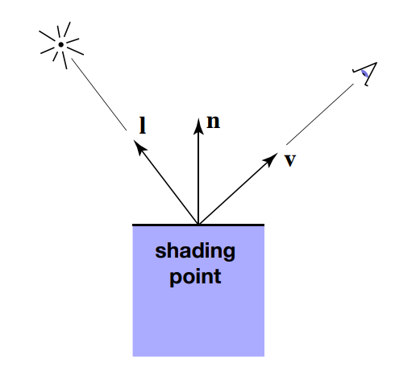
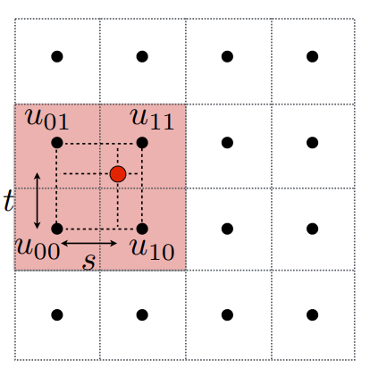

暑假开始时写的存货，对应课程前三个主题，大概率不会更新后面几何与光追的内容了。就算是复制课上内容也太折磨人了QwQ

<!--more-->

## 目录
<!-- @import "[TOC]" {cmd="toc" depthFrom=1 depthTo=6 orderedList=false} -->

<!-- code_chunk_output -->

  - [目录](#目录)
- [变换Transformation](#变换transformation)
  - [点与矢量的表示](#点与矢量的表示)
  - [基本变换](#基本变换)
    - [缩放Scaling](#缩放scaling)
    - [剪切Shearing](#剪切shearing)
    - [旋转Rotation](#旋转rotation)
      - [罗德里格旋转公式](#罗德里格旋转公式)
    - [反射Reflection](#反射reflection)
    - [仿射变换AffineTransformations](#仿射变换affinetransformations)
  - [视图Viewing](#视图viewing)
    - [基础概念](#基础概念)
      - [摄像机Camera & 窗口Window](#摄像机camera-窗口window)
      - [视角FoV](#视角fov)
      - [转换过程](#转换过程)
    - [相机变换CameraTransformation](#相机变换cameratransformation)
      - [平移](#平移)
      - [旋转](#旋转)
    - [投影变换Projection Transformation](#投影变换projection-transformation)
      - [正交投影变换OrthographicProjectionTransformation](#正交投影变换orthographicprojectiontransformation)
      - [透视投影变换ProjectiveTransformations](#透视投影变换projectivetransformations)
- [光栅化rasterization](#光栅化rasterization)
  - [三角形的光栅化](#三角形的光栅化)
    - [缺点](#缺点)
  - [反走样（Antialiasing）](#反走样antialiasing)
    - [SuperSampling Anti-Aliasing(SSAA)](#supersampling-anti-aliasingssaa)
  - [z缓冲（Z-Buffering）](#z缓冲z-buffering)
- [着色shading](#着色shading)
  - [Blinn-Phong Reflectance Model](#blinn-phong-reflectance-model)
    - [漫反射光](#漫反射光)
    - [反射高光](#反射高光)
    - [全局光照](#全局光照)
  - [纹理映射Texture Mapping](#纹理映射texture-mapping)
    - [插值](#插值)
      - [重心坐标](#重心坐标)
    - [问题](#问题)
      - [多个pixel映射到一个texel](#多个pixel映射到一个texel)
      - [Texture Magnification 纹理放大](#texture-magnification-纹理放大)
        - [mipmap](#mipmap)
      - [各向异性过滤Anisotropic Filtering](#各向异性过滤anisotropic-filtering)
        - [Ripmap](#ripmap)
    - [纹理的应用](#纹理的应用)

<!-- /code_chunk_output -->

# 变换Transformation

计算机图形学（Computer Graphics）一个基本的目标是将三维物体的模型（Model）用一个映射来将其表现在我们的屏幕上，而模型中的基本参数一般都是以一个三维坐标或者说是三维位置矢量作为其载体，同时线性代数是一个能够保留点与点之间的一个相对关系且易于计算的工具，因此我们在CG中利用线性代数来做变换（Transformation）以实现上面所提到的映射

## 点与矢量的表示

一个三维的点$P$可以表示为一个四维矢量


$$P=(x,y,z,w),w\neq 0$$


其中$(\frac{x}{w},\frac{y}{w},\frac{z}{w})$是三维点的坐标，$w$是一个任意非零的权值

而三维的矢量$v$则令$w=0$，有


$$v=(x,y,z,0)$$


这么设置的原因由[仿射变换](#仿射变换affinetransformations)给出

## 基本变换

这里介绍一系列基本变换及其矩阵表示

### 缩放Scaling

将$x,y,z$分别变为原来的$s_x,s_y,s_z$倍


$$Scaling(s_x,s_y,s_z)=\left(\begin{matrix}s_x&0&0&0\\0&s_y&0&0\\0&0&s_z&0\\0&0&0&1\end{matrix}\right)$$


### 剪切Shearing

将一个$x-y$平面的正方形变换为与$y$轴夹角为$\phi$的平行四边形，其面积不变


$$Shearing(\phi)=\left(\begin{matrix}1&\tan{\phi}&0&0\\0&1&0&0\\0&0&1&0\\0&0&0&1\end{matrix}\right)$$


### 旋转Rotation


$$Rotation(\theta)=\left(\begin{matrix}\cos{\theta}&-\sin{\theta}&0&0\\\sin{\theta}&\cos{\theta}&0&0\\0&0&1&0\\0&0&0&1\end{matrix}\right)$$


#### 罗德里格旋转公式

罗德里格旋转公式（Rodrigues' rotation formula）是给定转轴和角度之后写出旋转后向量的表达式


$$\vec{v}_{rot}=\vec{v} \cos{\theta}+(\vec{k}\times \vec{v})\sin \theta+\vec{k}(\vec{k}\cdot\vec{v})(1-\cos \theta)$$


### 反射Reflection


$$Reflection_{yz}=\left(\begin{matrix}-1&0&0&0\\0&1&0&0\\0&0&1&0\\0&0&0&1\end{matrix}\right)$$


### 仿射变换AffineTransformations

只考虑平移（Translation）


$$Translation(t_x,t_y,t_z)=\left(\begin{matrix}1&0&0&t_x\\0&1&0&t_y\\0&0&1&t_z\\0&0&0&1\end{matrix}\right)$$


可以看出，对于点$(x,y,z,w)$，有$x'=x+wt_x$，实际上的坐标$\frac{x'}{w}=\frac{x}{w}+t_x$

而对于矢量，$w=0$，变换前后相等

## 视图Viewing

### 基础概念

#### 摄像机Camera & 窗口Window

为了能够将三维物体映射到一个有限长度的平面上，我们需要一个摄像机作为取景的源头，其由7个参数来决定，其中3个来描述**坐标**，2个描述**摄像机朝向**，剩下2个描述摄像机**顶部朝向**（即最终形成画面的竖直线的方向）

而窗口决定了摄像机收录的视椎的范围，从摄像机到窗口及其内部的视线确定画面实际展现的范围，可由2个参数**长宽比**（AspectRatio）和**视角**（FoV）表示

#### 视角FoV

视角（Field-of-View）是窗口的参数之一，设视角为$\theta$，窗口长宽以及离摄像机的距离分别为$r,t,n$，一般$n<0$，计算公式为


$$\tan{\frac{\theta}{2}}=\frac{t}{|n|}$$


#### 转换过程

如何将物体投影到窗口上，一般由下面三个步骤实现

- 相机变换（camera transformation），将相机变换到原点，朝向$z$轴负向，顶部朝向$y$轴正向
- 投影变换（projection transformation），将相机可见的点都压缩到$x,y,z\in [-1,1]^3$的范围中，这个坐标称为**正则化空间坐标**（canonical space coordinate）
- 视口变换（viewport transformation），将$x,y,z\in [-1,1]^3$变换到窗口的矩阵

### 相机变换CameraTransformation

#### 平移


$$T_{view}=\left(\begin{matrix}1&0&0&-x\\0&1&0&-y\\0&0&1&-z\\0&0&0&1\end{matrix}\right)$$


#### 旋转

设假设摄像机的的上方向为$\hat{t}$，同时往$\hat{g}$方向看，$\hat{e}=\hat{g}\times \hat{t}$


$$\left(\begin{matrix}1&0&0\\0&1&0\\0&0&-1\end{matrix}\right)=R\left(\begin{matrix}\hat{e}&\hat{t}&\hat{g}\end{matrix}\right)$$



$$R^{-1}=\left(\begin{matrix}\hat{e}&\hat{t}&\hat{g}\end{matrix}\right)\left(\begin{matrix}1&0&0\\0&1&0\\0&0&-1\end{matrix}\right)=\left(\begin{matrix}\hat{e}&\hat{t}&-\hat{g}\end{matrix}\right)$$



$$R=(R^{-1})^T=\left(\begin{matrix}\hat{e}^{T}\\\hat{t}^{T}\\-\hat{g}^{T}\end{matrix}\right)$$



$$R_{view}=\left(\begin{matrix}R&0\\0&1\end{matrix}\right)$$


### 投影变换Projection Transformation

不同的投影变换决定了最终不同的效果，在不同的场景可以使用不同的投影变换

#### 正交投影变换OrthographicProjectionTransformation

把$[l,r]\times[b,t]\times[f,n]$构成的空间压缩成$[-1,1]^3$的立方体中


$$M_{ortho}=\left(\begin{matrix}\frac{2}{r-l}&0&0&-\frac{r+l}{r-l}\\0&\frac{2}{t-b}&0&-\frac{t+b}{t-b}\\0&0&\frac{2}{n-f}&-\frac{n+f}{n-f}\\0&0&0&1\end{matrix}\right)$$


#### 透视投影变换ProjectiveTransformations

保留点到摄像头直线与摄像头面向直线的夹角，与同一个射线物体之间的前后关系的映射，由相似原理推导而出


$$M_{persp\rightarrow ortho}=\left(\begin{matrix}n&0&0&0\\0&n&0&0\\0&0&n+f&-nf\\0&0&1&0\end{matrix}\right)$$



$$M_{persp}=M_{ortho}M_{persp\rightarrow ortho}$$


# 光栅化rasterization

模型经常由非常多的三角形来表示，而三角形通过上个章节的线性变换之后，要做的事就是将三角形转化为点阵图然后渲染到屏幕上，这个过程就是**光栅化**（Rasterization）

## 三角形的光栅化

可以通过一个映射来定义


$$inside(t,x,y)=\begin{cases}1&Point(x,y)\ in\ \triangle\ t\\ 0&otherwise\end{cases}$$


即点在三角形内则该点设为有颜色

### 缺点

这样的映射非常的直接简单，但会造成锯齿形状的走样（Aliasing）

## 反走样（Antialiasing）

### SuperSampling Anti-Aliasing(SSAA)

又称Full-Scene Anti-Aliasing(FSAA)

加大采样的频率（如4xSSAA就是将原本$n\times n$的采样空间扩大为$2n\times 2n$），对屏幕的的每个像素点采样多个采样点求平均得到每个点对应的颜色或其他数值

此时为了存储必要的信息，需要多维护四倍的空间进行缓存，其中每次更新的粒度都是最小的采样点

最后再将缓存的平均值写入最终将要渲染出来的缓存区

同时后面提到的Z-Buffer也同样需要维护

## z缓冲（Z-Buffering）

当三角形互相遮蔽，对于每个像素点需要一个Z-buffer存储距离摄像机的远近信息，并根据这个信息来对着色进行修正

# 着色shading

## Blinn-Phong Reflectance Model

这是一个简单的光照模型，这个模型简单地将物体的发光情况分为三部分

- Diffuse reflection 漫反射光线
- Specular highlights 反射高光
- Ambient lighting 环境光线

并利用简单的公式来模拟这些光线，下面先考虑一些物理量

由上面这个简单的模型，我们有下面的公式

### 漫反射光


$$L_d=k_d\cdot\frac{I}{r^2}\cdot \max{(0,\vec{n}\cdot\vec{l}\ )}$$


其中$k_d$是漫反射系数，通常与颜色有关，$I$为光源的发光强度

### 反射高光

引入新的量


$$\vec{h}=\frac{\vec{n}+\vec{l}}{|\vec{n}+\vec{l}|}$$


为$\vec{n},\vec{l}$中位线的向量，称为半程向量


$$L_s=k_s\cdot\frac{I}{r^2}\cdot (\max{(0,\vec{n}\cdot\vec{h})})^p$$


### 全局光照


$$L_a=k_aI_a$$


## 纹理映射Texture Mapping

将物体的纹理平铺至一张平面图，三角形的每个顶点存储一个二元值$(u,v)$，通过该值来查询纹理对应坐标的像素颜色作为三角形顶点的颜色

### 插值

对于三角形内部的点，颜色可由三角形三个顶点的插值来实现，常用的一种插值是利用重心坐标来实现

#### 重心坐标


$$\begin{array}{r} (x, y)=\alpha A+\beta B+\gamma C\\\alpha+\beta+\gamma=1 \\0\le\alpha,\beta,\gamma\le1 \end{array}$$


通过计算面积比，有


$$\begin{aligned} \alpha &=\frac{-\left(x-x_{B}\right)\left(y_{C}-y_{B}\right)+\left(y-y_{B}\right)\left(x_{C}-x_{B}\right)}{-\left(x_{A}-x_{B}\right)\left(y_{C}-y_{B}\right)+\left(y_{A}-y_{B}\right)\left(x_{C}-x_{B}\right)} \\ \beta &=\frac{-\left(x-x_{C}\right)\left(y_{A}-y_{C}\right)+\left(y-y_{C}\right)\left(x_{A}-x_{C}\right)}{-\left(x_{B}-x_{C}\right)\left(y_{A}-y_{C}\right)+\left(y_{B}-y_{C}\right)\left(x_{A}-x_{C}\right)} \\ \gamma &=1-\alpha-\beta \end{aligned}$$


需要注意的是三角形重心坐标不是线性变换守恒的，当投影之后需要重新求对应的重心坐标

### 问题

纹理的像素点我们称为texel

#### 多个pixel映射到一个texel

因为纹理大小过小，映射到屏幕中多个像素点为同一个色块，造成大尺度的锯齿

解决方法之一：双线性插值

选择距离纹理映射后的坐标最近的四个点$u_{00},u_{01},u_{10},u_{11}$，$x,y$最小值分别为$x_{min},y_{min}$，这四个点组成的矩形正好能够将映射坐标囊括起来

设$lerp(x,v_0,v_1)=v_0+x(v_0-v_1)$，$s=x-x_{min},t=y-y_{min}$


$$
u_0=lerp(s,u_{00},u_{10})
\\
u_1=lerp(s,u_{01},u_{11})
\\
f(x,y)=lerp(t,u_0,u_1)
$$


#### Texture Magnification 纹理放大

一个pixel对应多个texel，采样率不足，出现走样

解决方法可以参考之前的反走样

也可以通过mipmap来实现

##### mipmap

mipmap是一个近似的处理方法，通过提前将贴图处理成一系列预先计算和优化过的图片所组成的文件，且进行pixel投影到纹理的形状为某个长度的正方形的假定，覆盖了一部分的贴图，根据这个假定我们可以将纹理进行$2\times2$为粒度的平均，之后按照pixel的位置对mipmap进行读取

mipmap可以按照像素个数进行分层，如果贴图的基本尺寸是256x256像素的话,它mipmap就会有8个层级。每个层级是上一层级的四分之一的大小，依次层级大小就是：128x128;64x64;32x32;16x16;8x8;4x4;2x2;1x1(一个像素)

其中每层某个像素都处理为上一层对应的四个像素的平均值

而假定一个pixel四个点映射到纹理上为一个正方形，则就能够直接读取mipmap对应层数的对应值取到我们想要的数值

而pixel投影的大小由下面的式子决定


$$L=\max{\left(\sqrt{(\frac{du}{dx})^2+(\frac{dv}{dx})^2}\right),
\left(\sqrt{(\frac{du}{dy})^2+(\frac{dv}{dy})^2}\right)}$$



$$D=\log_{2}L$$


在确定投影的层数之后利用双线性插值确定颜色大小

而对于$D$，在从近到远的过程中会发生突变，于是我们对$D$同样进行线性插值，这叫做三线性插值

#### 各向异性过滤Anisotropic Filtering

##### Ripmap

前面的mipmap只考虑了投影为正方形的情况，为了考虑投影为矩形的情况，我们可以考虑对矩形尺度上做相似的操作

### 纹理的应用

- Environment lighting - Environment Map 环境光纹理
- Bump Mapping 凹凸贴图
- Displacement mapping 位移贴图